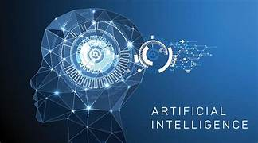
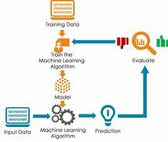
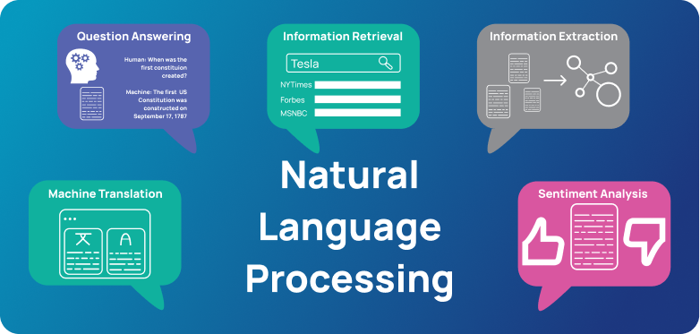
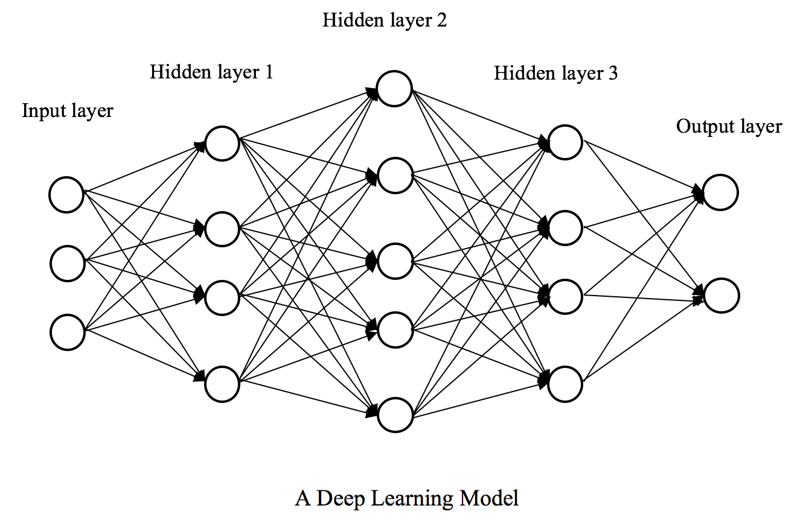
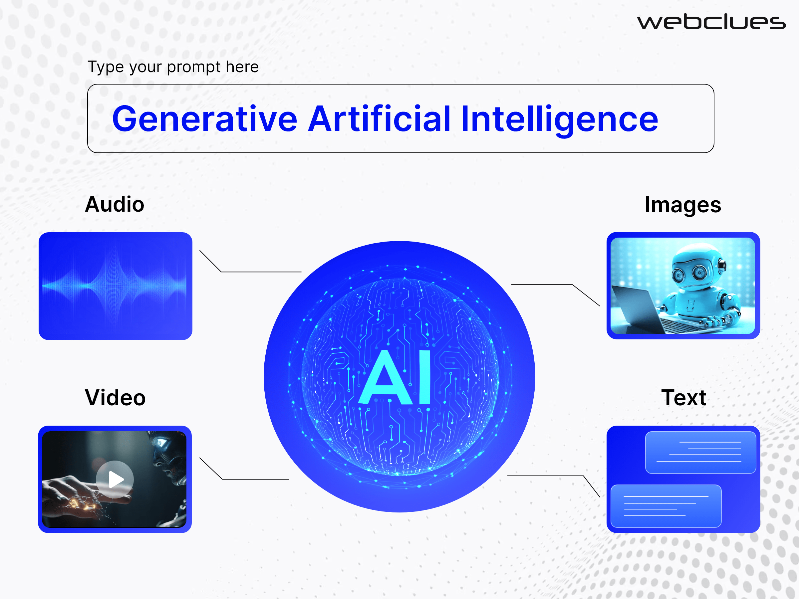
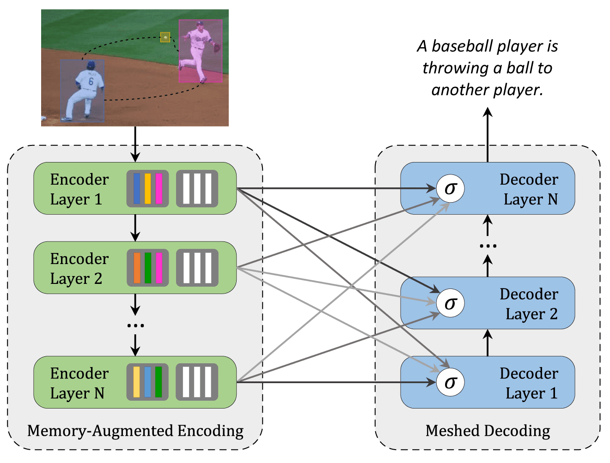

# Generative AI

## Table of Contents
--------------------------

* [**Generative AI Concepts**](#Generative-AI-Concepts)

	- [Introduction to AI](#Introduction-to-AI)
	- [Introduction to ML](#Introduction-to-ML) 
	- [Introduction to NLP](#Introduction-to-NLP)
	- [Introduction to Deep Learning](#Introduction-to-Deep-Learning) 
	- [Introduction to GAI](#Introduction-to-GAI)
	- [Introduction to Transformers](#Introduction-to-Transformers) 

### Introduction to AI
AI or Artificial Intelligence, refers to the simulation of human intelligence in machines that are programmed to think and act like humans. These machines are designed to perform tasks that typically require human intelligence, such as visual perception, speech recognition, decision-making, language translation, and problem-solving.

**Why AI?**

Artificial Intelligence (AI) is important for a multitude of reasons, spanning various fields and industries. Firstly, AI has the potential to revolutionize efficiency and productivity across sectors by automating repetitive tasks, thus freeing up human resources to focus on more complex and creative endeavors. Additionally, AI systems can analyze vast amounts of data at speeds far beyond human capabilities, leading to more informed decision-making in areas such as healthcare, finance, and logistics. Moreover, AI technologies enable advancements in fields like healthcare by assisting in disease diagnosis and drug discovery, ultimately improving patient outcomes. 
In the realm of education, AI-powered personalized learning platforms can cater to individual student needs, enhancing the quality and accessibility of education. Furthermore, AI plays a crucial role in addressing societal challenges, from climate change mitigation to disaster response, by providing predictive analytics and optimizing resource allocation. Overall, AI's importance lies in its transformative potential to drive innovation, enhance efficiency, and tackle complex problems across various domains, ultimately shaping the future of humanity.

**Advantages:**

1. **Automation**: AI can automate repetitive tasks, leading to increased efficiency and productivity. This allows businesses to streamline operations and allocate human resources to more strategic and creative endeavors.

2. **Data Analysis**: AI systems excel at analyzing vast amounts of data quickly and accurately. This capability enables organizations to derive valuable insights, make data-driven decisions, and identify trends or patterns that may not be apparent to humans.

3. **Improved Decision Making**: AI algorithms can process complex data and provide recommendations or predictions, helping individuals and organizations make better-informed decisions across a wide range of domains, from finance and healthcare to marketing and logistics.

4. **Cost Reduction**: By automating tasks and optimizing processes, AI can help businesses reduce operational costs. This is achieved through improved efficiency, minimized errors, and better resource allocation.

5. **24/7 Availability**: AI-powered systems can operate round-the-clock without the need for breaks, leading to enhanced customer service and support. Chatbots, virtual assistants, and automated customer service agents are examples of AI applications that provide continuous assistance to users.

6. **Personalization**: AI technologies enable personalized experiences by analyzing user behavior and preferences. This personalization can be seen in recommendation systems, content customization, and targeted advertising, leading to improved user satisfaction and engagement.

7. **Innovation**: AI fosters innovation by enabling the development of new products, services, and solutions that were previously unattainable. From autonomous vehicles and medical diagnostics to smart homes and predictive maintenance, AI is driving groundbreaking advancements across various industries.

8. **Risk Mitigation**: AI can help organizations mitigate risks by identifying potential threats, frauds, or anomalies in real-time. By analyzing data patterns and detecting deviations from normal behavior, AI systems can alert businesses to potential security breaches or operational risks.

9. **Enhanced Healthcare**: AI is revolutionizing healthcare by assisting in medical diagnosis, drug discovery, personalized treatment plans, and remote patient monitoring. AI-powered medical imaging and diagnostic systems, for example, can help healthcare professionals detect diseases earlier and with higher accuracy.

10. **Environmental Impact**: AI can contribute to sustainability efforts by optimizing energy usage, reducing waste, and enabling more efficient resource management. From optimizing transportation routes to predicting climate change impacts, AI technologies play a vital role in addressing environmental challenges.

**Disadvantages:**

1. **Job Displacement**: One of the most significant concerns surrounding AI is the potential for automation to replace human jobs. Tasks that are repetitive or routine in nature are particularly susceptible to automation, leading to unemployment or the need for workers to acquire new skills to remain relevant in the workforce.

2. **Bias and Fairness Issues**: AI systems can inherit biases present in the data used to train them, leading to biased outcomes or decisions. This can perpetuate existing societal inequalities, particularly in areas such as hiring, lending, and criminal justice, where AI algorithms may inadvertently discriminate against certain groups.

3. **Privacy Concerns**: AI systems often rely on vast amounts of personal data to function effectively. This raises concerns about data privacy and security, as unauthorized access to sensitive information could lead to breaches, identity theft, or other privacy violations.

4. **Lack of Transparency**: Some AI algorithms, particularly those based on complex machine learning models, can be opaque or difficult to interpret. This lack of transparency can hinder accountability and trust, making it challenging to understand how AI systems arrive at their decisions or recommendations.

5. **Overreliance on Technology**: Dependence on AI systems could lead to a loss of human skills and critical thinking abilities. Relying too heavily on automated solutions may erode human judgment and decision-making capabilities, making individuals and organizations more vulnerable to errors or failures in the event of system malfunctions or disruptions.

6. **Ethical Dilemmas**: AI raises complex ethical questions regarding its use in various domains, including warfare, surveillance, and autonomous vehicles. Determining the ethical boundaries of AI applications, such as whether to prioritize human safety over machine autonomy in critical situations, poses significant challenges for policymakers and society as a whole.

7. **Security Risks**: AI systems themselves can be vulnerable to cyberattacks, manipulation, or adversarial attacks designed to exploit weaknesses in their algorithms. Malicious actors could potentially exploit AI-powered systems for nefarious purposes, such as spreading disinformation, committing fraud, or launching cyberattacks.

8. **Exacerbation of Inequality**: The adoption of AI technologies may widen the gap between those who have access to and can benefit from them and those who do not. Socioeconomic disparities could be exacerbated if marginalized communities lack access to AI tools or are disproportionately affected by job displacement and other negative consequences of AI adoption.

9. **Unemployment and Economic Disruption**: The widespread automation enabled by AI could lead to significant disruptions in labor markets and economic structures. Displaced workers may struggle to find new employment opportunities, leading to social unrest and economic instability if adequate support and retraining programs are not in place.

10. **Unintended Consequences**: The complexity and unpredictability of AI systems mean that they may produce unintended or unforeseen consequences. Even well-intentioned AI applications could have unintended negative effects on society, the environment, or human behavior, highlighting the importance of careful consideration and ethical oversight in AI development and deployment.

### Introduction to ML

Machine learning (ML) is a discipline of artificial intelligence (AI) that provides machines with the ability to automatically learn from data and past experiences while identifying patterns to make predictions with minimal human intervention.

**Why ML?**

Machine Learning (ML) stands as a cornerstone in modern technology, offering a multitude of benefits across various domains. Its importance lies in its ability to process vast amounts of data, uncover valuable insights, and make predictions with unprecedented accuracy. ML algorithms enable organizations to automate tasks, optimize processes, and drive efficiency, ultimately leading to significant cost savings and improved productivity. Moreover, ML facilitates personalized experiences for users through recommendation systems, virtual assistants, and targeted advertising, enhancing customer satisfaction and engagement. In fields like healthcare, ML plays a crucial role in diagnosing diseases, predicting treatment outcomes, and discovering new drugs, revolutionizing patient care and medical research. Furthermore, ML empowers scientific exploration by analyzing complex datasets, simulating phenomena, and accelerating discoveries across disciplines. Its impact extends to cybersecurity, environmental monitoring, financial forecasting, and beyond, shaping the way we understand, interact with, and navigate the world. In essence, ML's importance lies in its transformative potential to drive innovation, solve complex problems, and unlock new opportunities, making it an indispensable tool in the digital age.

**Advantages:**

1. **Data-driven Decision Making**: ML algorithms can analyze large volumes of data and extract valuable insights, enabling organizations to make more informed and data-driven decisions.

2. **Automation of Repetitive Tasks**: ML automates repetitive tasks, reducing the need for manual intervention and freeing up human resources to focus on more strategic and creative endeavors.

3. **Improved Accuracy and Efficiency**: ML algorithms can perform complex calculations and tasks with a high degree of accuracy and efficiency, surpassing human capabilities in tasks such as image recognition, natural language processing, and predictive modeling.

4. **Personalization**: ML enables personalized experiences by analyzing user data and preferences to tailor recommendations, content, and services according to individual needs and preferences.

5. **Scalability**: ML models can scale to handle large and diverse datasets, making them suitable for applications ranging from small-scale experiments to enterprise-level deployments.

6. **Continuous Learning**: ML models can learn and improve over time as they are exposed to more data and feedback, leading to continuously improving performance and adaptability.

7. **Predictive Analytics**: ML enables predictive modeling and forecasting, allowing businesses to anticipate trends, customer behavior, market changes, and other future events with greater accuracy.

8. **Automation of Complex Tasks**: ML algorithms can automate complex tasks that are difficult or impractical to program using traditional rule-based approaches, such as autonomous driving, robotic process automation, and industrial control systems.

9. **Enhanced Customer Experience**: ML-powered applications, such as chatbots and virtual assistants, provide instant and personalized assistance to customers, improving satisfaction and engagement.

10. **Innovation**: ML fosters innovation by enabling the development of new products, services, and solutions that were previously unattainable. From autonomous vehicles and medical diagnostics to personalized medicine and recommendation systems, ML drives groundbreaking advancements across various industries.

**Disadvantages:**

1. **Bias and Fairness Issues**: ML algorithms can inherit biases present in the data used to train them, leading to biased outcomes or decisions. This can perpetuate existing societal inequalities, particularly in areas such as hiring, lending, and criminal justice.

2. **Overfitting**: ML models may become overly complex and fit too closely to the training data, leading to poor generalization performance on unseen data. Overfitting can result in models that fail to perform well in real-world scenarios.

3. **Data Dependency**: ML algorithms require large amounts of high-quality labeled data for training, which may be difficult or expensive to obtain. In domains with limited or biased data, ML models may produce unreliable results or exacerbate existing biases.

4. **Interpretability**: Some ML models, particularly those based on complex deep learning architectures, can be opaque or difficult to interpret. This lack of interpretability hinders transparency, accountability, and trust in the decision-making process.

5. **Security Risks**: ML models can be vulnerable to adversarial attacks, where small, carefully crafted perturbations to input data can cause the model to make incorrect predictions. Adversarial attacks pose security risks in applications such as image recognition, autonomous driving, and malware detection.

6. **Ethical Dilemmas**: ML raises complex ethical questions regarding its use in various domains, including privacy, surveillance, and autonomous systems. Determining the ethical boundaries of ML applications, such as the trade-off between individual privacy and public safety, requires careful consideration and oversight.

7. **Resource Intensive**: Training and deploying ML models can be computationally intensive and require significant computational resources, including high-performance hardware and large-scale data storage infrastructure. This can limit the accessibility of ML technologies to organizations with limited resources.

8. **Lack of Robustness**: ML models may fail to generalize well to new or unseen data, particularly in situations where the distribution of the data changes over time or differs from the training data. ML systems must be robust to changes and variations in the environment to be reliable in real-world applications.

9. **Regulatory Compliance**: ML applications in domains such as healthcare, finance, and autonomous systems are subject to regulatory requirements and standards to ensure safety, fairness, and accountability. Compliance with regulations such as GDPR, HIPAA, and industry-specific standards adds complexity and overhead to ML development and deployment.

10. **Human Dependence**: While ML can automate many tasks, human oversight and intervention are still necessary to ensure the quality and integrity of ML systems. Human biases and errors can propagate through the design, development, and deployment of ML applications, highlighting the importance of ethical considerations and human judgment in ML workflows.

###	Introduction to NLP 

Natural language processing (NLP) is the ability of a computer program to understand human language as it's spoken and written -- referred to as natural language. It's a component of artificial intelligence (AI).

**Why NLP?**

Natural Language Processing (NLP) stands as a pivotal field in modern technology, crucial for a myriad of reasons across various sectors. Its importance lies in its capacity to bridge the gap between human language and computer understanding, facilitating seamless communication and interaction between individuals and machines. NLP enables computers to comprehend, analyze, and generate human language in a manner that is both efficient and effective. This capability underpins a vast array of applications, from virtual assistants and chatbots that provide instant support and assistance to users, to search engines and information retrieval systems that sift through vast volumes of textual data to extract relevant information.
Moreover, NLP empowers sentiment analysis, allowing businesses to gauge public opinion, monitor brand reputation, and understand customer feedback more accurately. In healthcare, NLP aids in extracting insights from medical records, diagnosing diseases, and facilitating clinical decision-making. Additionally, NLP enables language translation, text summarization, named entity recognition, and question answering systems, unlocking new possibilities for cross-cultural communication, knowledge extraction, and information dissemination. Overall, the importance of NLP lies in its transformative potential to enhance human-computer interaction, streamline information processing, and unlock new avenues for innovation and discovery in the digital age.

**Advantages:**

1. **Enhanced Human-Computer Interaction**: NLP enables seamless communication between humans and computers through natural language interfaces such as virtual assistants, chatbots, and voice-controlled devices. This enhances user experience and accessibility by allowing users to interact with technology in a more intuitive and natural way.

2. **Efficient Information Retrieval**: NLP techniques facilitate the extraction of relevant information from large volumes of text, enabling faster and more accurate information retrieval. NLP-powered search engines can understand user queries and return relevant results, improving productivity and decision-making.

3. **Sentiment Analysis and Opinion Mining**: NLP enables the analysis of human emotions, attitudes, and opinions expressed in text data. Sentiment analysis and opinion mining are used in applications such as market research, social media monitoring, and customer feedback analysis, helping businesses gauge public opinion and sentiment towards their products or services.

4. **Language Translation and Localization**: NLP facilitates language translation and localization by automatically translating text between different languages and adapting content to suit local dialects, cultural norms, and linguistic conventions. Translation tools powered by NLP enable cross-cultural communication and facilitate global collaboration.

5. **Text Summarization and Extraction**: NLP techniques can automatically summarize and extract key information from large volumes of text, making it easier to digest and comprehend. Text summarization tools are used in applications such as news aggregation, document summarization, and content curation, enabling users to quickly extract relevant information from lengthy documents or articles.

6. **Named Entity Recognition and Information Extraction**: NLP enables the identification and extraction of structured information from unstructured text data, such as named entities (e.g., people, organizations, locations) and relevant facts or events. This capability is useful for tasks such as information retrieval, knowledge extraction, and data mining.

7. **Question Answering Systems**: NLP powers question answering systems that can understand natural language questions and provide accurate and relevant answers by extracting information from textual sources. These systems are used in applications such as customer support, virtual assistants, and educational platforms, improving user engagement and satisfaction.

8. **Medical and Healthcare Applications**: NLP plays a crucial role in analyzing medical texts, extracting information from electronic health records, and supporting clinical decision-making. NLP-powered healthcare applications facilitate tasks such as medical coding, disease diagnosis, and pharmacovigilance, improving patient care and outcomes.

9. **Text Generation and Natural Language Generation**: NLP enables the generation of human-like text by training models to produce coherent and contextually relevant sentences. Natural Language Generation (NLG) techniques are used in applications such as chatbots, content generation, and personalized messaging, enhancing user interaction and engagement.

10. **Cross-disciplinary Applications**: NLP techniques have applications across diverse domains, including finance, law, education, journalism, and more. From analyzing financial reports and legal documents to improving educational materials and journalistic content, NLP enhances productivity, decision-making, and innovation across various fields.

**Disadvantages:**

1. **Ambiguity and Context Sensitivity**: Natural language is inherently ambiguous and context-dependent, making it challenging for NLP systems to accurately interpret meaning. Ambiguities arise from linguistic nuances, idiomatic expressions, sarcasm, and cultural context, leading to potential misinterpretations or errors in NLP analysis.

2. **Complexity and Variability**: Natural language exhibits a high degree of complexity and variability, with diverse syntax, semantics, and linguistic structures across languages and dialects. NLP systems may struggle to handle linguistic diversity, leading to reduced performance in multilingual or cross-cultural settings.

3. **Data Limitations and Bias**: NLP models rely on large amounts of labeled data for training, which may be scarce, biased, or unrepresentative of real-world language usage. Biases in training data can lead to biased outcomes or decisions in NLP applications, perpetuating stereotypes, inequalities, or inaccuracies in language processing.

4. **Domain-specific Challenges**: NLP systems may struggle to handle domain-specific terminology, jargon, or specialized language used in technical, scientific, or professional contexts. Domain adaptation techniques are required to fine-tune NLP models for specific domains, which may require additional resources and expertise.

5. **Privacy and Security Concerns**: NLP applications often involve processing sensitive or personal data, raising concerns about privacy, data protection, and security. NLP systems must adhere to strict privacy regulations and security standards to safeguard user information and prevent unauthorized access or misuse of data.

6. **Interpretability and Explainability**: NLP models, particularly those based on complex deep learning architectures, can be opaque or difficult to interpret. Lack of interpretability hinders transparency, accountability, and trust in NLP systems, making it challenging to understand how decisions are made or to diagnose errors or biases.

7. **Scalability and Resource Intensiveness**: Training and deploying NLP models can be computationally intensive and require significant computational resources, including high-performance hardware and large-scale data storage infrastructure. Scalability challenges may arise when deploying NLP systems in resource-constrained environments or handling large volumes of text data in real-time applications.

8. **Legal and Ethical Considerations**: NLP applications raise legal and ethical questions regarding issues such as data privacy, intellectual property rights, freedom of speech, and fairness. Compliance with regulations such as GDPR, HIPAA, and industry-specific standards is essential to ensure that NLP systems respect user rights and adhere to ethical principles.

9. **Misuse and Manipulation**: NLP technologies can be misused or manipulated for malicious purposes, such as spreading misinformation, generating fake news, or conducting phishing attacks. Adversarial attacks can exploit vulnerabilities in NLP systems to deceive users, evade detection, or manipulate outcomes.

10. **Human Dependence and Error Propagation**: While NLP systems can automate many tasks, human oversight and intervention are still necessary to ensure the quality and integrity of NLP outputs. Human biases and errors can propagate through the design, development, and deployment of NLP applications, affecting the reliability and fairness of language processing outcomes.

###	Introduction to Deep Learning 

Deep learning is a branch of machine learning which is based on artificial neural networks. It is capable of learning complex patterns and relationships within data. In deep learning, we don’t need to explicitly program everything. It has become increasingly popular in recent years due to the advances in processing power and the availability of large datasets. Because it is based on artificial neural networks (ANNs) also known as deep neural networks (DNNs). These neural networks are inspired by the structure and function of the human brain’s biological neurons, and they are designed to learn from large amounts of data.

**Why Deep learning?**

Deep learning is indispensable in the modern era due to its transformative capabilities across various domains and applications. As a subset of machine learning, deep learning leverages neural networks with multiple layers to process vast amounts of data and extract complex patterns and features. Its importance lies in its unparalleled ability to tackle tasks that were previously considered challenging or infeasible with traditional machine learning techniques. Deep learning excels in tasks such as image recognition, speech recognition, natural language processing, and medical diagnosis, among others. In fields like computer vision, deep learning models have achieved human-level or superhuman performance, revolutionizing industries ranging from healthcare and automotive to retail and entertainment. Moreover, deep learning enables the development of autonomous systems, such as self-driving cars and drones, by providing the underlying technology for perception, decision-making, and control. Its impact extends to areas like finance, cybersecurity, and scientific research, where deep learning models are deployed for fraud detection, malware analysis, and drug discovery, respectively. Furthermore, the versatility and scalability of deep learning make it well-suited for handling large-scale data and complex tasks in today's data-driven world. In essence, the importance of deep learning lies in its capacity to drive innovation, solve complex problems, and unlock new opportunities across diverse domains, shaping the future of technology and society.

**Advantages:**

1. **Feature Learning**: Deep learning models can automatically learn hierarchical representations of data, extracting relevant features at different levels of abstraction. This eliminates the need for manual feature engineering, enabling more efficient and effective learning from raw data.

2. **Scalability**: Deep learning models can scale to handle large volumes of data and complex tasks, making them suitable for big data scenarios and high-dimensional data such as images, videos, and audio.

3. **Flexibility**: Deep learning architectures, such as convolutional neural networks (CNNs), recurrent neural networks (RNNs), and transformer models, are flexible and adaptable to different types of data and tasks. This versatility allows deep learning to be applied across diverse domains, from computer vision and natural language processing to speech recognition and reinforcement learning.

4. **State-of-the-Art Performance**: Deep learning models have achieved state-of-the-art performance in various benchmark tasks, surpassing traditional machine learning approaches and even human-level performance in some domains. This superior performance is attributed to the ability of deep learning models to learn complex patterns and representations from large datasets.

5. **End-to-End Learning**: Deep learning enables end-to-end learning, where the entire system is trained jointly to optimize a specific objective function. This approach eliminates the need for manual feature extraction and separate modeling of intermediate tasks, leading to more efficient and streamlined workflows.

6. **Transfer Learning**: Deep learning models trained on large datasets can be fine-tuned and transferred to related tasks with limited labeled data, leveraging the learned representations for improved performance. Transfer learning enables faster and more cost-effective development of deep learning applications, especially in domains with limited annotated data.

7. **Real-Time Processing**: Deep learning models can be optimized for real-time processing and inference, enabling applications that require low-latency responses, such as autonomous vehicles, robotics, and online recommendation systems.

8. **Adaptability to Unstructured Data**: Deep learning excels at processing unstructured data, such as images, text, and audio, by capturing complex patterns and relationships within the data. This adaptability makes deep learning suitable for applications where traditional rule-based approaches may struggle, such as image recognition, natural language understanding, and speech recognition.

9. **Continuous Improvement**: Deep learning models can be continuously updated and improved over time as they are exposed to more data and feedback. This iterative learning process allows deep learning systems to adapt to changing environments and improve performance with experience.

10. **Wide Range of Applications**: Deep learning has applications across diverse domains, including healthcare, finance, automotive, retail, entertainment, and more. From medical diagnosis and drug discovery to autonomous driving and personalized recommendations, deep learning is driving innovation and transforming industries worldwide.

**Disadvantages:**

1. **Large Data Requirements**: Deep learning models often require massive amounts of labeled data for training, which can be time-consuming and expensive to acquire. Obtaining sufficient data can be particularly challenging for niche or specialized domains where labeled data is scarce.

2. **High Computational Resources**: Training deep learning models typically demands significant computational resources, including powerful hardware such as GPUs (Graphics Processing Units) or TPUs (Tensor Processing Units) and large-scale distributed computing infrastructure. This can lead to high energy consumption and operational costs.

3. **Complexity and Interpretability**: Deep learning models are often highly complex and opaque, making them difficult to interpret and understand. The inner workings of deep neural networks can be inscrutable, hindering transparency, accountability, and trust in decision-making processes.

4. **Overfitting**: Deep learning models are prone to overfitting, where they perform well on training data but generalize poorly to unseen data. Overfitting can occur when models are too complex relative to the amount of training data, leading to reduced performance in real-world applications.

5. **Need for Expertise**: Designing, training, and fine-tuning deep learning models require specialized knowledge and expertise in areas such as machine learning, optimization, and software engineering. Skilled professionals are needed to navigate the complexities of deep learning effectively.

6. **Data Privacy and Security Concerns**: Deep learning models trained on sensitive or personal data may raise privacy and security concerns, particularly if the data is vulnerable to unauthorized access, misuse, or breaches. Protecting privacy and ensuring data security is essential when deploying deep learning systems in real-world applications.

7. **Transferability Issues**: Deep learning models trained on one dataset or task may not generalize well to different datasets or tasks, a phenomenon known as transfer learning. Fine-tuning pre-trained models or adapting them to new domains may require additional labeled data and computational resources.

8. **Lack of Robustness**: Deep learning models may lack robustness to adversarial examples, where small, carefully crafted perturbations to input data can cause the model to make incorrect predictions. Adversarial attacks pose security risks in applications such as image recognition, autonomous driving, and malware detection.

9. **Ethical and Bias Concerns**: Deep learning models can inherit biases present in the training data, leading to biased outcomes or decisions. Biases in data or algorithms can perpetuate societal inequalities and discrimination, raising ethical concerns about fairness, transparency, and accountability in deep learning applications.

10. **Dependency on Labeled Data**: Deep learning models typically rely on labeled data for supervised learning tasks, which may be costly and time-consuming to annotate. Labeling errors or inconsistencies can propagate through the training process, affecting the quality and performance of deep learning models.

### Introduction to GAI 

Generative artificial intelligence (generative AI, GenAI, or GAI) is artificial intelligence capable of generating text, images, videos, or other data using generative models,often in response to prompts. Generative AI models learn the patterns and structure of their input training data and then generate new data that has similar characteristics.

**Why Generative AI?**

Generative AI, epitomized by Generative Adversarial Networks (GANs), stands as a crucial innovation in the realm of artificial intelligence, offering unique capabilities and transformative potential across numerous domains. Its importance lies in its ability to generate new data samples that closely resemble real data, thus expanding the scope of AI applications in creative tasks, data augmentation, and problem-solving. Generative AI addresses the need for AI systems to not only analyze existing data but also to create new content and data samples autonomously. This is particularly valuable in fields such as image generation, text synthesis, and music composition, where the ability to produce novel and realistic content is paramount. Additionally, generative AI facilitates data augmentation, enabling the generation of synthetic data to supplement limited or biased datasets, thereby improving the robustness and generalization capabilities of machine learning models. Furthermore, generative AI fosters innovation and creativity by empowering individuals and organizations to explore new possibilities and solutions through the generation of novel content and ideas. Its applications span diverse domains, including entertainment, design, healthcare, and cybersecurity, illustrating its broad-reaching impact and significance in advancing the frontier of AI technology. In essence, the importance of generative AI lies in its capacity to unlock new avenues for creativity, problem-solving, and exploration in the ever-expanding landscape of artificial intelligence.

**Advantages:**

1. **Data Augmentation**: Generative AI enables the creation of synthetic data that closely resembles real data, which can be used to augment existing datasets. This facilitates the training of machine learning models on larger and more diverse datasets, improving their performance and generalization capabilities.

2. **Creative Content Generation**: Generative AI can produce new content such as images, videos, music, and text that is indistinguishable from human-created content. This is valuable in fields such as entertainment, design, and advertising, where the ability to generate novel and engaging content is essential.

3. **Anomaly Detection**: Generative AI can be used for anomaly detection by generating data samples that are similar to normal data and then identifying samples that deviate significantly from the norm. This is useful in cybersecurity, fraud detection, and quality control, where detecting anomalies is critical for preventing security breaches and ensuring product quality.

4. **Data Imputation**: Generative AI can fill in missing or incomplete data by generating plausible values based on the available data. This is beneficial in healthcare, finance, and other domains where missing data can hinder analysis and decision-making.

5. **Domain Adaptation**: Generative AI can be used for domain adaptation by generating synthetic data in the target domain that is similar to the source domain. This is useful in transfer learning scenarios, where models trained on one domain can be adapted to perform well in a different domain with limited labeled data.

6. **Privacy Preservation**: Generative AI can generate synthetic data that preserves the statistical properties of the original data while protecting sensitive information. This enables organizations to share data for research or collaboration purposes without compromising individual privacy.

7. **Style Transfer and Image Editing**: Generative AI can perform style transfer and image editing by generating new images that combine the content of one image with the style of another. This is useful in graphic design, digital art, and photography, allowing artists and designers to create unique and visually appealing compositions.

8. **Drug Discovery and Material Design**: Generative AI can be used in drug discovery and material design by generating new molecules or materials with desired properties. This accelerates the process of discovering new drugs, materials, and compounds with potential applications in healthcare, manufacturing, and engineering.

9. **Simulation and Gaming**: Generative AI can generate realistic simulations and game environments by creating virtual worlds, characters, and objects. This enhances the realism and immersion of virtual reality (VR) and augmented reality (AR) experiences, as well as computer-generated imagery (CGI) in movies and video games.

10. **Human-Computer Interaction**: Generative AI can be used to create conversational agents, chatbots, and virtual assistants that generate natural and engaging responses in human-like language. This improves the quality of human-computer interaction and enables more personalized and responsive user experiences.

**Disadvantages:**

1. **Mode Collapse**: GANs can suffer from mode collapse, where the generator produces limited varieties of output that fail to capture the full diversity of the underlying data distribution. This can result in generated samples that lack diversity and realism.

2. **Training Instability**: Training GANs can be notoriously unstable, with the generator and discriminator networks sometimes oscillating or converging to suboptimal solutions. Tuning GAN hyperparameters and designing appropriate loss functions are non-trivial tasks that require careful experimentation and expertise.

3. **Quality Control**: Ensuring the quality and realism of generated samples can be challenging, as there is no guarantee that all generated samples will be of high quality. Human supervision and manual inspection may be necessary to filter out low-quality or unrealistic samples.

4. **Data Bias Amplification**: Generative AI models can amplify biases present in the training data, leading to the generation of biased or discriminatory output. This can perpetuate existing societal inequalities and reinforce stereotypes in generated content.

5. **Computationally Intensive**: Training and generating samples with GANs can be computationally intensive, requiring powerful hardware such as GPUs (Graphics Processing Units) or TPUs (Tensor Processing Units) and substantial amounts of time and resources. This limits the accessibility of generative AI techniques to organizations with sufficient computational resources.

6. **Ethical Concerns**: Generative AI raises ethical concerns related to the potential misuse or generation of harmful content, such as deepfakes, fake news, or offensive imagery. Ethical guidelines and regulations are needed to govern the responsible development and deployment of generative AI technologies.

7. **Legal Implications**: The use of generative AI for generating copyrighted content, such as images, music, or text, may raise legal issues related to intellectual property rights and copyright infringement. Clear legal frameworks are necessary to address ownership and licensing of generated content.

8. **Privacy Risks**: Generative AI models trained on sensitive or personal data may pose privacy risks if they inadvertently reveal sensitive information or can be reverse-engineered to reconstruct original data samples. Privacy-preserving techniques and data anonymization methods are needed to mitigate these risks.

9. **Environmental Impact**: The computational demands of training and using generative AI models contribute to their environmental impact, including energy consumption and carbon emissions. Developing more efficient algorithms and hardware solutions can help reduce the environmental footprint of generative AI.

10. **Deployment Challenges**: Deploying generative AI models in real-world applications may require overcoming technical challenges related to model deployment, integration with existing systems, and scalability to handle production workloads. Additionally, ensuring the security and robustness of deployed models is critical to prevent adversarial attacks and data breaches.

###	Introduction to Transformers 

Transformers are a type of deep learning architecture that utilize self-attention mechanisms to capture dependencies between input tokens efficiently. They have revolutionized natural language processing and various other fields due to their ability to process entire sequences in parallel, enabling state-of-the-art performance in tasks such as language translation and text generation.

**Why Transformer?**

Transformers have emerged as a fundamental innovation in artificial intelligence, addressing critical challenges and unlocking new capabilities in various domains. Their importance lies in their ability to effectively capture long-range dependencies in sequential data, revolutionizing natural language processing (NLP) and beyond. Unlike traditional architectures like recurrent neural networks (RNNs) and convolutional neural networks (CNNs), transformers can process entire sequences in parallel, making them highly efficient and scalable for both training and inference tasks. This parallel processing capability has enabled transformers to achieve state-of-the-art performance in numerous NLP tasks, including language translation, text summarization, sentiment analysis, and language modeling. Moreover, transformers have found applications beyond NLP, such as in image generation, speech recognition, and recommendation systems, showcasing their versatility and adaptability across diverse domains. By enabling more effective processing of sequential data and capturing complex relationships between elements, transformers are driving advancements in artificial intelligence and fostering innovation in areas ranging from communication and entertainment to healthcare and finance. Thus, the importance of transformers lies in their transformative impact on AI, facilitating breakthroughs in understanding, generating, and manipulating sequential data, and paving the way for future advancements in technology and society.

**Advantages:**

1. **Efficient Long-Range Dependency Modeling**: Transformers excel at capturing long-range dependencies in sequential data, enabling them to understand context and relationships between distant elements in a sequence more effectively compared to traditional architectures like recurrent neural networks (RNNs).

2. **Parallel Processing**: Unlike RNNs, transformers can process entire sequences in parallel, making them highly efficient for both training and inference tasks. This parallelization significantly reduces computation time, leading to faster training and inference speeds.

3. **Versatility**: Transformers have proven to be highly versatile and adaptable across various tasks and domains. They have achieved state-of-the-art performance in natural language processing tasks such as language translation, text summarization, sentiment analysis, and language modeling, as well as in other domains like image generation, speech recognition, and recommendation systems.

4. **Scalability**: Transformers can handle input sequences of variable lengths, making them scalable to diverse datasets and tasks. This scalability enables transformers to process large volumes of data efficiently, making them suitable for real-world applications with complex input sequences.

5. **Attention Mechanism**: The attention mechanism in transformers allows the model to focus on relevant parts of the input sequence while ignoring irrelevant information. This attention mechanism enhances the model's ability to extract meaningful patterns and relationships from data, leading to improved performance in various tasks.

6. **Transfer Learning**: Pre-trained transformer models can be fine-tuned on specific tasks with limited labeled data, leveraging the learned representations from large-scale pre-training. This transfer learning approach enables faster and more efficient development of models for new tasks and domains.

7. **Interpretability**: Transformers provide better interpretability compared to some other deep learning architectures. The attention mechanism allows users to understand which parts of the input sequence the model is focusing on, aiding in model debugging, analysis, and decision-making.

8. **State-of-the-Art Performance**: Transformers have achieved state-of-the-art performance in numerous natural language processing benchmarks and competitions. Their superior performance in tasks such as language translation, text generation, and sentiment analysis has made them the go-to choice for many researchers and practitioners in the field.

**Disadvantages:**

1. **Computational Resources**: Training and deploying transformer models can be computationally expensive, requiring powerful hardware such as GPUs or TPUs and substantial amounts of memory. This limits the accessibility of transformers to organizations with sufficient computational resources.

2. **Complexity**: Transformers have a complex architecture with numerous hyperparameters and components, making them challenging to train and fine-tune effectively. Tuning hyperparameters and designing appropriate architectures require expertise and extensive experimentation.

3. **Data Efficiency**: Transformers may require large amounts of data to achieve optimal performance, especially for tasks with complex patterns or domain-specific nuances. Obtaining labeled data can be time-consuming and expensive, particularly for specialized domains or languages with limited resources.

4. **Interpretability**: While transformers provide better interpretability compared to some other deep learning architectures, interpreting the model's decisions and understanding its inner workings can still be challenging. The attention mechanism provides insights into which parts of the input sequence the model focuses on, but understanding the model's decision-making process comprehensively remains an ongoing research challenge.

5. **Fine-Tuning Challenges**: Fine-tuning pre-trained transformer models for specific tasks may require substantial effort and expertise. Determining the optimal architecture, hyperparameters, and training procedure for the target task can be non-trivial, and achieving optimal performance may require extensive experimentation and tuning.

6. **Attention Mechanism Overhead**: While the attention mechanism in transformers allows the model to capture long-range dependencies efficiently, it also introduces additional computational overhead, particularly for large input sequences. Managing memory consumption and computational resources can be challenging, especially for tasks with long input sequences.

7. **Domain Adaptation**: Transformers trained on one domain may not generalize well to different domains with different data distributions or characteristics. Fine-tuning pre-trained models or adapting them to new domains may require additional labeled data and computational resources, limiting their applicability in diverse settings.

8. **Bias and Fairness**: Transformers can inherit biases present in the training data, leading to biased outcomes or decisions in downstream applications. Biases in data or algorithms can perpetuate societal inequalities and discrimination, raising ethical concerns about fairness, transparency, and accountability in transformer-based applications.
